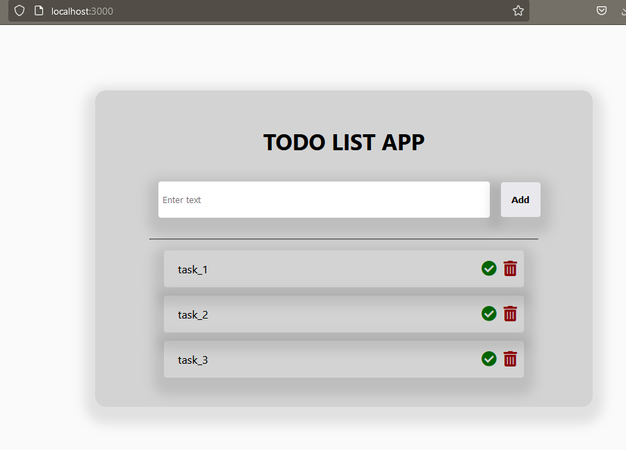

# About the project
A todo-list app made in React using material-ui/core for consistent and beautiful UI. Also uses redux for persistance storage. This is a clone project made for practise



# How to run
```
npm i
npm run start
```